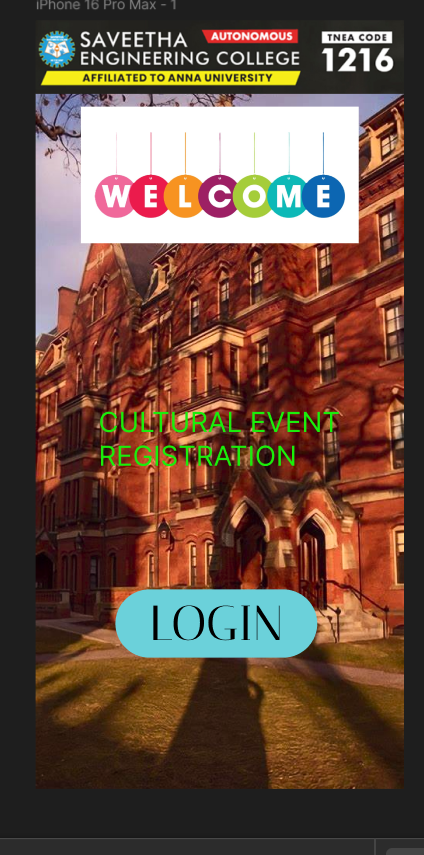
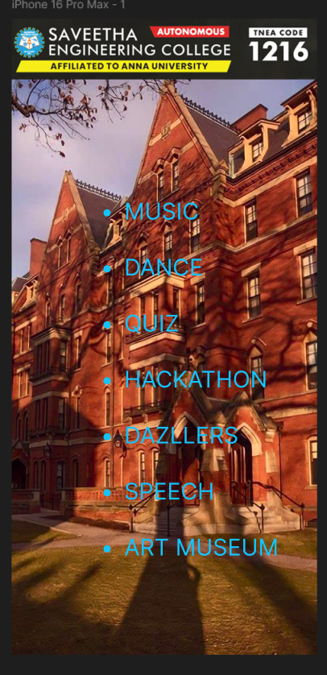
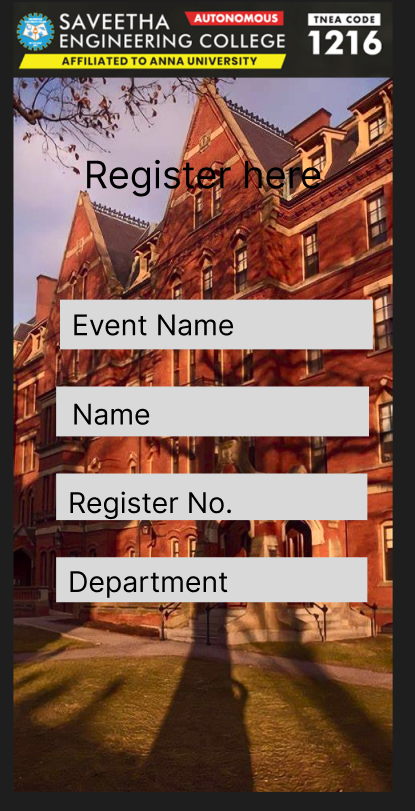
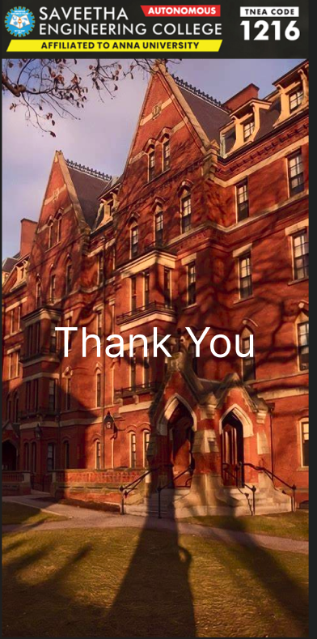

# Ex06 Event Registration Web Application
## Date: 10-05-2025

## AIM:
To design, develop and deploy a web application for event registration.

## DESIGN STEPS:

### Step 1:
Create a new frame.

### Step 2:
Select any one preset size of your choice.

### Step 3:
Select the shapes you need.

### Step 4:
Import images as needed.

### Step 5:
Create pages based on your need and link them.

### Step 6:

Validate the HTML and CSS code.

### Step 6:

Publish the website in the given URL.

## DESIGN TOOL:
Figma

## CODE:
```
Page 1
<div class="container--0-">
  <svg
    width="263"
    height="89"
    viewBox="0 0 263 89"
    fill="none"
    xmlns="http://www.w3.org/2000/svg"
  >
    <rect width="263" height="89" rx="44.5" fill="#6BD1DA"></rect>
  </svg>
  <div class="text-0-1-1">LOGIN</div>
  <div class="text-0-1-2">CULTURAL EVENT <br />REGISTRATION</div>
</div>

page 2

<div class="container--0-">
  
  <div class="text-0-1-1">
    MUSIC<br /><br />DANCE<br /><br />QUIZ<br /><br />HACKATHON<br /><br />DAZLLERS<br /><br />SPEECH<br /><br />ART
    MUSEUM
  </div>
</div>

page 3

<div class="container--0-">
  
  <div class="text-0-1-1">Register here</div>
  <svg
    width="396"
    height="63"
    viewBox="0 0 396 63"
    fill="none"
    xmlns="http://www.w3.org/2000/svg"
  >
    <rect width="396" height="63" fill="#D9D9D9"></rect>
  </svg>
  <div class="text-0-1-3">Event Name</div>
  <svg
    width="396"
    height="63"
    viewBox="0 0 396 63"
    fill="none"
    xmlns="http://www.w3.org/2000/svg"
  >
    <rect width="396" height="63" fill="#D9D9D9"></rect>
  </svg>
  <div class="text-0-1-5">Name</div>
  <svg
    width="394"
    height="59"
    viewBox="0 0 394 59"
    fill="none"
    xmlns="http://www.w3.org/2000/svg"
  >
    <path d="M0 0H394V59H0V0Z" fill="#D9D9D9"></path>
  </svg>
  <div class="text-0-1-7">Register No.</div>
  <svg
    width="394"
    height="57"
    viewBox="0 0 394 57"
    fill="none"
    xmlns="http://www.w3.org/2000/svg"
  >
    <rect width="394" height="57" fill="#D9D9D9"></rect>
  </svg>
  <div class="text-0-1-9">Department</div>
</div>

page 4

<div class="container--0-">
  
  <div class="text-0-1-1">Thank You</div>
</div>
```

## OUTPUT:
## Page 1:

## Page 2:

## Page 3:

## Page 4:

## RESULT:
The program to design, develop and deploy a web application for event registration is completed successfully.
